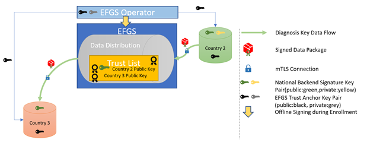

# EFGS cryptografic key handling overview  
The efgs system works with certificates at different levels.  
**Connection level:** ensure that data transmission is secure and that only participating countries are entitled to use the system  
**signing Level:** ensure that the data provided are from a given country and enable other countries to prove that  

The following figure incorporates both of these levels.

## Steps to install certificates

**On EFGS system:**
- mTLS certificate - *connection level* - establish mutual connection with national backends (NB)  
must be installed in XXXX

- Trust Anchor certificate - *singning level* - provide kind-of CA for Batch validation means  
must be installed in XXXX

**Onboarding Member States**
- mTLS certificate - *connection level* - establish mutual connection with EFGS
must be installed in the whitelist of the EFGS endpoint XXXX
- signing certificate - *singning level* - to validate batches are from the pretended origin
  Must be signed with private key of of the EFGS Trust Anchor certificate.  
  The resulting File in .pem format must be added to the database, column XXX in raw format  

- The public keys of the **EFGS trust anchor** and the **EFGS TLS** certificates must be provided to the onboarded country

## JKS - Java Keystore
For JAVA applications there is a special repository for storing security certification  - the java key store.
#### Generating an empty keystore  
If you have no keystore, you need to setup one. As you cannot create an empty keystore, we will generate one with an initial keypair, that we delete afterwards.  
`keytool -genkey -keyalg="RSA" -alias` *some-server-name* `-dname "CN=TEMP" -keystore` *filename-of-your-keystore* `-storepass` *password-to-access-keystore* `-deststoretype pkcs12 -noprompt`  

`keytool` -delete -alias *some-server-name* -keystore *filename-of-your-keystore* -storepass *password-to-access-keystore*

You end up with an empty java keystore at *filename-of-your-keystore*.  

### Inserting an PKCS#12 (.p12) file to your jks  
Assuming you have a PKCS12 certificate bundle, to insert this to the JKS you need to do the following:

`keytool -importkeystore -srckeystore` *your-pkcs12file.p12* `-srcstorepass` *your-pkcs12-password-for-that-file* `-sourcestoretype pkcs12 -deststore` *filename-of-your-keystore* `-deststoretype jks -deststorepass` *password-to-access-keystore*  

This will import your PKCS#12 certificate bundle in the java keystore.

## Create Trustanchor keystore

`keytool -importcert -alias` *efgs_trust_anchor* `-file` *cert.pem* `-keystore` *trust-anchor-keystore-filename* `-storepass` *your-trustanchor-keystorepassword* `-noprompt`

## Install PEM Raw data in DB

