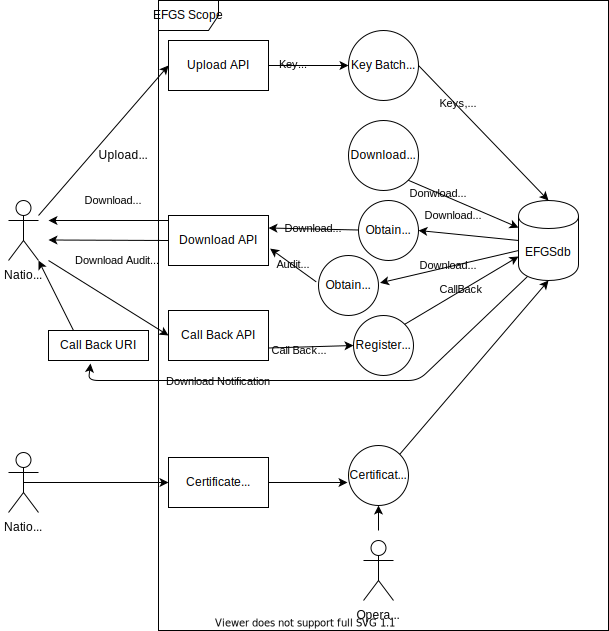
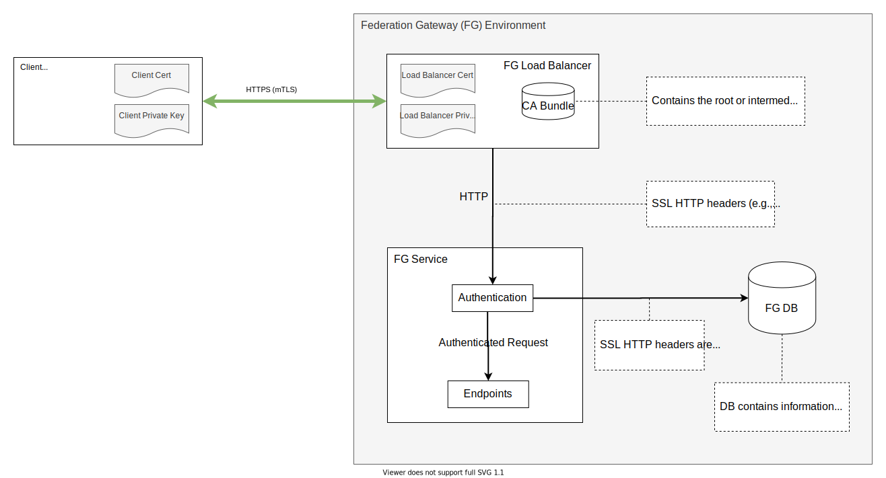
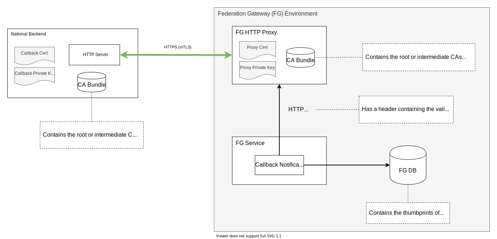
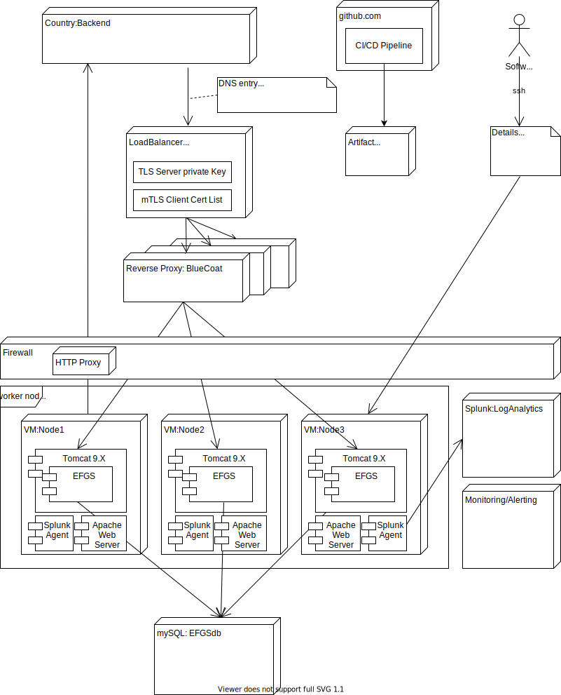

# Software Design European Federation Gateway Service
by Alexander Stiefel (alexander.stiefel@t-systems.com)

##	Introduction
This documents describes detailed aspects of the implementation of the European Federation Gateway Service. It is closely related to the document [European Proximity Tracing An Interoperability Architecture](https://ec.europa.eu/health/sites/health/files/ehealth/docs/mobileapps_interop_architecture_en.pdf), 
to which it adds details and the document [European Interoperability Certificate
Governance](https://ec.europa.eu/health/sites/health/files/ehealth/docs/mobileapps_interop_certificate_governance_en.pdf) which defines the certificate structure and documents important naming conventions. 

Target audience for this document are software engineers who want to get a better understanding of the insight of the implementation to be able to contribute.

This document is not finished and major aspects are missing.
This document is still in proposal state, meaning feedback is welcome and will change its content.


#	Overview
##	Purpose of the Software System
Many countries are developing proximity tracing apps to reduce the spreading of COVID-19, generally using the Exposure Notifications API from Google and Apple. 
While these national solutions reflect the specifics of each country a solution is required to allow interoperablity between those national solutions. 

This software implements a pan european solution a "European Federation Gateway Service" allowing national backends to uploads the keys of newly infected people 
 and downloads the diagnosis keys from the other countries participating in this scheme. 

##	Core Entities
|Entity|	Definition|	
| ------------- |:-------------:|
| Diagnosis Key| An exposure key in the sense of the GAEN format (https://developers.google.com/android/exposure-notifications/exposure-key-file-format) |
| Batch| An ordered set of diagnostic keys	|
| Upload Tag| Unique Logical Name for uploads | 		
| Batch Tag Name | Only relevant for downloads |
| Country | A european country which interacts with the system | 

# Context View
The diagram below shows the dataflow from and to national backends.


National Health Authorities acting the the certificate management process.

# Software Design

## Database Design

Entities
| Entity     | Content                                          | Delete Strategy                        |
| ---------- | ------------------------------------------------ | -------------------------------------- |
| callback_subscription | stores details about the callback                | no automatic deletion                |
| callback_task         | stores details about a specific callback task    | no automatic deletion |
| certificate           | stores the certificate for the countries         | no automatic deletion |
| diagnosiskeybatch     | represents donwload batches                      | automated deletion after 14 days |
| diagnosiskey          | represents a single diagnostic key               | automated deletion after 14 days |

### Data Deletion
The semantic scope for automated deletion are all data that is related to human individuals. This data should only be available for 14 days.

The automated deletion after 14 days is implemented as scheduled job in the web application, the relevant criteria is the "created_at" attribute of the entity.

### Database Isolation Level

The isolation level REPEATABLE READ is used to prevent the creation of download batches containing partial upload batch data.

## Monitoring
## Audit Logging
The purpose of the audit logging is to track the usage of the system.

### Log File Structure

The target environment for the service is a Apache Tomcat Server. So all log output will be written to stdout
which is redirected to `catalina.out` log file. So the content of this file needs to be collected by the Ops team.

### Log Message Structure

All log messages are following one format. The log format is inspired by the Splunk best practices document ([link](https://dev.splunk.com/enterprise/docs/developapps/addsupport/logging/loggingbestpractices/))

Each log message contains key value pairs which will represent the required data.
All of these log messages are consisting of mandatory and additional fields. The mandatory fields are always at the begin of a log message.
 The key value pairs are connected by a "=" and seperated by  "," followed by a space. If the value consists of more than one word, the value will be wrapped within double quotes.
 Multiple log messages are seperated by a new line.
 The following mandatory fields will be sent with each log message:

| Field      | Content                                          | Example Value                          |
| ---------- | ------------------------------------------------ | -------------------------------------- |
| timestamp  | ISO-8601 formatted timestamp (always UTC)        | 2020-08-04T16:44:45.999Z                |
| level      | Log Level                                        | INFO                                   |
| hostname   | The hostname of the current node                 | srv01                                  |
| pid        | Process ID                                       | 44929                                  |
| traceId    | Correlation ID for tracing                       | d058309145b9f7a3                       |
| spanId     | Span ID for tracing                              | d058309145b9f7a3                       |
| thread     | ID of the thread                                 | main                                   |
| class      | The class from which the message is comming from | e.i.f.service.DiagnosisKeyBatchService |
| message    | Information about what has happened              | started document batching process      |
| exception* | Stack Trace, if available                        | org.springframew...                    |

Example:
```
timestamp="2020-08-04 17:19:46.038", level=INFO, pid=44929, traceId=e7d394f3b0431c68, spanId=e7d394f3b0431c68, thread=scheduling-1, class=e.i.f.service.DiagnosisKeyBatchService, message="started document batching process", exception=""
```

*exception field will only be written to log file. In console stack traces will be printed directly.

These key-value-pairs can be followed by additional attributes. The additional attributes are individual for each log message.

### Log messages 

| Event | Log Level | Log Message | Additional attributes |
| ----- | --------- | ----------- | --------------------- |
| **Authentication**
| Authentication failed, no thumbprint or distinguish name provided | ERROR | No thumbprint or distinguish name | n/a |
| Authentication failed, country property not present in distinguish name | ERROR | Country property is missing | dnString, thumbprint |
| Authentication failed, client has used unkown cert for authentication | ERROR | Unknown client certificate | dnString, thumbprint |
| Authentication failed, client has used revoked cert for authentication | ERROR | Certificate is revoked | dnString, thumbprint |
| Successful Authentication | INFO | Successful Authentication | dnString, thumbprint |
| **Diagnosis Key Upload**
| Batch Signature verification failed, no signer information in PKCS#7 object | ERROR | no signer information | n/a | 
| Batch Signature verification failed, no signing certificate in PKCS#7 object | ERROR | no signer certificate | n/a | 
| Batch Signature verification failed, no signing certificate is expired | ERROR | signing certificate expired | certNotBefore, certNotAfter | 
| Batch Signature verification failed, found different origins in diagnosis keys | ERROR | different origins | certThumbprint, certCountry, batchCountries | 
| Batch Signature verification failed, could not validate batch | ERROR | error verifying batch signature | exception | 
| Batch Signature verification failed, signature of signing certificate could not be verified | ERROR | invalid signing certificate signature | n/a | 
| Batch Signature verification failed, unknown signing cert | ERROR | unknown signing certificate | certThumbprint | 
| Batch Signature verification failed, batch was signed with revoked certificate | ERROR | certificate is revoked | certThumbprint | 
| Batch Signature verification failed, signature does not match to batch | ERROR | wrong signature | n/a | 
| Successful Batch Signature verification | INFO | verified batch signature | batchTag, numKeys, certThumbprint | 
| Batch Upload failed, uploader has provided too many diagnosis keys at once | ERROR | too many diagnosis keys | batchTag, numKeys, maxKeys | 
| Batch Upload failed, uploader has provided an already existing BatchTag | ERROR | batchtag already exists | batchTag, numKeys | 
| Batch Upload failed, uploader has provided one ore more keys which have a different country then uploader cert | ERROR | invalid uploader country | batchTag, numKeys | 
| Batch Upload partly failed, not all keys could be inserted | ERROR | error inserting keys | insertedKeyCount, conflictKeysCount, failedKeysCount | 
| Successful Batch Upload | INFO | successfull batch upload | batchTag, numKeys |
| **DiagnosisKey Download**
| Batch Download failed, uploader requested too old keys | INFO | Requested date is too old | requestedDate |
| Batch Download failed, uploader requested batchTag within timerange but it could not found | INFO | Could not find any batches for given date | requestedDate |
| Batch Download failed, uploader requested batchTag that could not be found | INFO | Could not find batch with given batchTag | batchTag |
| Batch Download failed, requested date does not match date of batch | INFO | Given date does not match the requested batchTag | batchTag, requestedDate |
| Successful Batch Download | INFO | Successful Batch Download | batchTag | 
| **Audit Endpoint**
| Audit Information Request failed | ERROR | BatchTag Could not found | batchTag |
| Requested Audit Information | INFO | Requested Audit Information | batchTag |
| **Batching Service**
| Batch Process started | INFO | Batch process started | n/a |
| Batch Process: Created Batch | INFO | Batch created | batchTag, diagnosisKeyCount |
| Batch Process: Current execution took too much time. Execution is canceled | INFO | Maximum time for one batching execution reached. | batchTime |
| Batch Process: Could not find any more unbatched diagnosis keys | INFO | Successfully finished the document batching process - no more unprocessed diagnosis keys left | n/a | 
| Batch Process finished | INFO | Batch process finished | batchCount | 
| **Callback Interface**
| Deleting all created CallbackTasks for a subscription. This will be done if a CallbackSubscription gets invalid. | INFO | Deleting all CallbackTaskEntities for subscription. | callbackId, country |
| All CallbackSubscriptions are requested | INFO | Requested all callback subscriptions. | n/a |
| Saving a new CallbackSubscription to database. | INFO | Start saving callback subscription. | n/a |
| Callback URL verification: URL not parsable | ERROR | Could not parse URL | url |
| Callback URL verification: URL doesn't use https | ERROR | Callback URL must use https | url |
| Callback URL verification: URL contains query parameters | ERROR | URL must not contain any parameters | url |
| Callback URL verification: No CallbackCertificate for URL's host | ERROR | Could not find a Callback Certificate for host | host |
| Callback URL verification: CallbackCertificate for URL's host is revoked | ERROR | Found Callback Certificate, but it is revoked | thumbprint |
| Callback URL verification: Address of callback host cannot resolved via system DNS | ERROR | Could not resolve host for callback | url, hostname |
| Callback URL verification: Address of callback host is within a private address range | ERROR | IP Address of callback host is from private IP range. | url, hostname |
| CallbackTask Cleanup: Start deleting abandoned TaskLocks | INFO | Deleting task locks of abandoned tasks | n/a |
| CallbackTask Cleanup: Finished deleting abandoned TaskLocks | INFO | Removing of task locks of abandoned tasks finished. | taskCount |
| Callback Processing: Starting executor | INFO | Callback processing started. | n/a |
| Callback Processing: Preflight security check of URL has failed. CallbackSubscription will be deleted. | ERROR | Security check for callback url has failed. Deleting callback subscription. | callbackId, country, url |
| Callback Processing: Could not find a certificate for callback url | ERROR | Could not find callback certificate. | callbackId, country |
| Callback Processing: Callback request was successful | INFO | Successfully executed callback. Deleting callback task from database | retry, callbackId, country |
| Callback Processing: CallbackTask reached max amount of retries. CallbackSubscription will be deleted. | ERROR | Callback reached max amount of retries. Deleting callback subscription. | callbackId, country |
| Callback Processing: Got a response from callback url with positive status code (2xx) | INFO | Got 2xx response for callback. | callbackId, country |
| Callback Processing: Got a response from callback url with negative status code | ERROR | Got a non 2xx response for callback. | callbackId, country, statusCode |
| Callback Processing: Got no response from callback url | ERROR | Got no response for callback. | callbackId, country |
| Callback Processing: Setting execution lock for CallbackTask | INFO | Setting execution lock for CallbackTask. | taskId |
| Callback Processing: Removing execution lock for CallbackTask | INFO | Removing execution lock for CallbackTask. | taskId |
| Callback Processing: Executor loop has finished. | INFO | Callback processing finished. | n/a |
| **Content Negotiation**
| Content Serialization failed, Accept header is null | ERROR | Accept must be set | n/a |
| Content Serialization failed, unknown MIME Type in Accept Header | ERROR | Accepted Content-Type is not compatible | requestedMediaType |
| Content Serialization failed, version parameter in Accept Header is missing | ERROR | Version parameter of Accepted Content-Type is required | requestedMediaType |
| Content Serialization failed, incompatible version parameter | ERROR | Serialization: Protocol version is not compatible |requestedVersion |
| Content Deserialization failed, Content-Type header is null | ERROR | Accept must be set | n/a |
| Content Deserialization failed, unknown MIME Type in Content-Type Header | ERROR | Accepted Content-Type is not compatible | requestedMediaType |
| Content Deserialization failed, version parameter in Content-Type Header is missing | ERROR | Version parameter of Accepted Content-Type is required | requestedMediaType |
| Content Deserialization failed, incompatible version parameter | ERROR | Serialization: Protocol version is not compatible | requestedVersion |
| **Certificate Integrity Check**
| Certificate integrity check failed: Calculated thumbprint does not match stored thumbprint in database. (data manipulation!) | ERROR | Thumbprint in database does not match thumbprint of stored certificate. | certVerifyThumbprint |
| Certificate integrity check failed: Certificate signature is not issued by TrustAnchor or signature is corrupted (data manipulation!) | ERROR | Verification of certificate signature failed! | certVerifyThumbprint |
| Certificate integrity check failed: Certificate entity does not contain raw certificate or certificate signature. (data migration failure) | ERROR | Certificate entity does not contain raw certificate or certificate signature. | certVerifyThumbprint |
| Certificate integrity check failed: Raw certificate data does not contain a valid x509Certificate. (parsing error) | ERROR | Raw certificate data does not contain a valid x509Certificate. | certVerifyThumbprint |
| Certificate integrity check failed: Could not load EFGS-TrustAnchor from KeyStore. (initialization error) | ERROR | Could not load EFGS-TrustAnchor from KeyStore. | certVerifyThumbprint |
| Certificate integrity check failed: Could not use public key to initialize verifier. (initialization error) | ERROR | Could not use public key to initialize verifier. | certVerifyThumbprint |
| Certificate integrity check failed: Signature verifier is not initialized (initialization error) | ERROR | Signature verifier is not initialized | certVerifyThumbprint |
| Certificate integrity check failed: Unknown signing algorithm used by EFGS Trust Anchor. (initialization error) | ERROR | Unknown signing algorithm used by EFGS Trust Anchor. | certVerifyThumbprint |

 
# Integration into Data Center Infrastructure

## Load Balancer Integration
The load balancer terminates TLS, executes the mutual TLS authentication 
and forwards the http request to a worker node.

The IP of the load balancer is assigned to  registered domain name.

To allow authentication of the http request the load balancer adds header
 attributes containing meta information about the client certificate used to 
 authenticate the request.

See [2.1.2. Request Forwarding](#212-request-forwarding)

## Reverse Proxy
The reverse proxy distributes load over the tomcat instances. 
The main purpose for EFGS is to provide fail over behavior in case a tomcat instance is not available anymore.

## Database
The database is implemented as mySQL 5.7

## Log Analytics/Monitoring Integration

## Secret Management
Environment specific secrets are managed as part of the tomcat configuration. JDBC connections are provided as tomcat resources.

# Security

In this section, we define the security concept and security requirements for the Federation Gateway. The meaning of the words "MUST", "MAY", and "SHOULD" is defined in [RFC 2119](https://tools.ietf.org/html/rfc2119). To each requirement, an identifier, in the format "SecReq-{Number}", is assigned. 

## 1. Definitions 

**Client**: It refers to a National Backend (see [Federation Gateway Architecture Specification](https://ec.europa.eu/health/sites/health/files/ehealth/docs/mobileapps_interop_architecture_en.pdf)) that uploads or downloads diagnosis keys to/from the Federation Gateway. In the section "Client Authentication", Client and National Backend are used interchangeably. 

**Federation Gateway Components**

* **Load Balancer**: The component that receives the clients' requests (e.g., upload or download) and forwards them to the Federation Gateway Service after successful execution of the TLS protocol. 

* **Service**: The component that processes the clients' requests (e.g., upload or download) after successful client authentication. 

* **Database**: The component where the information (e.g., thumbprint) of the clients' certificates is stored.

* **HTTP Proxy**: The component that sends notifications (see Callback section) to the national backends after successful execution of the TLS protocol. 

**National Backend Certificates**

* **Authentication Certificate**: The certificate sent by a Client (National Backend) when executing mutual TLS with the Federation Gateway Load Balancer. This certificate is used to authenticate a Client.

* **Signing Certificate**: The certificate containing the public key which is used to verify the signature of a diagnosis key batch. This certificate is part of the Batch Signature (PKCS#7 Object).

* **Callback Certificate or National Backend Server Certificate**: The (server) certificate of a National Backend used for the TLS connections when the National Backend receives notifications (see Callback section) from the Federation Gateway. This certificate will be validated by the Federation Gateway HTTP Proxy.

**Batch Signature**: A [PKCS#7](https://tools.ietf.org/html/rfc5652) object containing, among others, the signature of a diagnosis key batch and the Signing Certificate.

**Client Authentication**: The process in which a Client is authenticated (using its Authentication Certificate) and authorized to request a diagnosis key upload or download.

**Certificate Thumbprint/Fingerprint**: Hash value of a certificate. We have defined the SHA-256 hash function for calculation of the fingerprint. In this document, certificate hash, certificate fingerprint, and certificate thumbprint are used interchangeably. 

## 2. Client Authentication

As shown in the figure below, the Federation Gateway (FG) Load Balancer authenticates the Clients (National Databases) via mTLS. Then, the clients' requests are forwarded to the FG Service, which validates the Client Authentication Certificate against a whitelist stored in the database. Once the certificate has been successfully verified, the FG Service passes the requests to the corresponding endpoints (e.g., upload or download).



**SecReq-001**  All the clients' requests (e.g., upload diagnostic key batch) MUST be authenticated. 

### 2.1. Load Balancer

**SecReq-002**  The Load Balancer MUST perform mutual TLS (mTLS) with the clients (national backends).  

**SecReq-003**  The Load Balancer MUST implement TLS termination.

#### 2.1.1. Certificate Validation

**SecReq-004**  If the client's certificate is not sent during the TLS handshake protocol, the Load Balancer MUST reject the client's request.

**SecReq-005**  If the client's certificate has expired, the Load Balancer MUST reject the client's request. The expiration is determined by the “notAfter” field (see [RFC 5280](https://tools.ietf.org/html/rfc5280#page-22)) of the certificate. 

**SecReq-006**  The Load Balancer MUST maintain a bundle containing the root CA certificates or intermediate CA certificates needed to verify (trust) the clients' authentication certificates. If a national backend uses a self-signed client authentication certificate, this certificate MUST be added to the CA bundle. 

**SecReq-007**  The Load Balancer MUST validate the client's certificate chain using its CA bundle (SecReq-006). If validation fails, the Load Balancer MUST reject the client's request. 

**SecReq-008**  The Load Balancer MAY maintain a Certificate Revocation List (CRL) (see [RFC 5280](https://tools.ietf.org/html/rfc5280#page-54)). 

**SecReq-009**  If SecReq-008 is fulfilled, the Load Balancer MUST reject a request, if the client's certificate is present in the CRL. 

#### 2.1.2. Request Forwarding

**SecReq-010**  If the client's certificate was successfully validated, the Load Balancer MUST forward the corresponding request to the FG Service via HTTP. 

**SecReq-011**  When a client's request is forwarded to the FG Service (See SecReq-010), the Load Balancer MUST add the following HTTP headers to the request:

| HTTP Header         | Description |
|---------------------|-------------|
| X-SSL-Client-SHA256 |	SHA-256 hash value of the DER encoded client's certificate. The so-called certificate fingerprint or thumbprint. (base64 encoded bytes, not base64 encoded hexadecimal string representation) |
| X-SSL-Client-DN	  | The subject Distinguished Name (DN) of the client's certificate (see [RFC 5280](https://tools.ietf.org/html/rfc5280#page-23) and [RFC 1719](https://tools.ietf.org/html/rfc1779#page-6)). The DN MUST contain the Country (C) attribute. (it is possible to transmit DN string URL encoded) |

### 2.2. Federation Gateway Service 

**SecReq-012**  The Federation Gateway (FG) Service MUST authenticate the clients' requests using the information sent in the HTTP requests (see SecReq-011) and the certificate information stored in the FG Database.

**SecReq-013**  To authenticate a client, the FG Service MUST perform the following steps:

1. Extract the value of the *X-SSL-Client-SHA256* and *X-SSL-Client-DN* headers from the HTTP request forwarded by the Load Balancer (see SecReq-011).

2. Extract the Country (C) attribute from the X-SSL-Client-DN value.

3. Query the FG Database using the X-SSL-Client-SHA256 value and the Country (C) attribute. Also, the certificate type (see SecReq-019) MUST be used in the query. In this case, the type is: AUTHENTICATION.

	1. If the query does not return any record, the FG Service MUST reject the client's request.

	2. If the query returns a record, the FG Service MUST check whether the certificate has not been revoked. If the certificate was already revoked, the FG Service MUST reject the request. Otherwise continue with step 4.

4. If the client’s request was authenticated successfully, the FG Service MUST forward the request to the corresponding endpoint (e.g., download or upload endpoint).

#### 2.2.1. Logging

**SecReq-014**  The FG Service MUST log each authentication attempt using the information of the X-SSL-Client-DN header.   

**SecReq-015**  The FG Service MUST use the log format defined by the Cyber Defense Center (CDC) **TODO:TBD**.   
 
### 2.3 Storing Secrets
The service has two secrets which need special handling during storage
- private key of EFGS<sub>TLS</sub> for outgoing TLS connections (for call back), to allow mTLS authentication
- public key of EFGS<sub>TA</sub> Trust Anchor  

These keys need to be stored seperate from the database. They are stored in two different Java KeyStore (https://en.wikipedia.org/wiki/Java_KeyStore) and deployed manually to the Tomcat instances. The keystores are protected with a password, the password is set as JVM property.


## 3. Batch Signature 

### 3.1. PKCS#7

**SecReq-016**  The batch signature MUST be generate based on the [RFC 5652](https://tools.ietf.org/html/rfc5652) standard.

**SecReq-017**  The PKCS#7 object MUST contain the Signing Certificate. 

**SecReq-018**  The "certificates" field MUST only contain the Signing Certificate.

**SecReq-019**  The PKCS#7 object MUST NOT contain the signed data (batch). The "eContent" field MUST be omitted (defined as "external signature" in the [PKCS#7 standard](https://tools.ietf.org/html/rfc5652)).

**SecReq-020**  The PKCS#7 MUST NOT be used to disseminate Certificate Revocation Lists (CRLs).

**SecReq-021**  The PKCS#7 object MUST be sent Base64 encoded to the Federation Gateway.

**SecReq-###**	The PKCS#7 signature object SHOULD contain a Date (UTC)

### 3.2. Signature Verification

The uploaded diagnostic keys must be signed at an abstract content level, which means 
not the content transferred via wire is signed but instead a constructed abstract 
content based on the transferred data.

**SecReq-022**  To create the signature and/or to verify it the diagnosis key data has been transformed 
into a byte stream with the structure defined below.  

The definition uses extended Backus–Naur form (ISO/IEC 14977)

ByteStream = DiagnosisKeyBatch ;

DiagnosisKeyBatch = { DiagnosisKey } ;

DiagnosisKey = keyData, rollingStartIntervalNumber, rollingPeriod, transmissionRiskLevel, visitedCountries, origin, verificationType ;


| Order        | Fieldname     | Start at Pos. |  Bytes  |Type (protobuf)	| Notes  |
| ------------ | ------------- | ------------- | ------- | -------------- | ------ |
| 1            | keyData       | 0             | k | bytes | Plain bytes | 
| 2			   | Seperator (.)	   | k			   | 1 | string | UTF-8 encoding		 | 
| 3            | rollingStartIntervalNumber       | k+1              |4 | uint32 |Big endian| 
| 4			   | Seperator	(.)   | k+5			   | 1 | string | UTF-8 encoding		 |
| 5            | rollingPeriod       | k+6             |4 | uint32 |Big endian| 
| 6			   | Seperator	(.)   | k+10			   | 1 | string | UTF-8 encoding		 |
| 7            | transmissionRiskLevel       | k+11             |4 | int32 |Big endian| 
| 8			   | Seperator	(.)   | k+15			   | 1 | string | UTF-8 encoding		 |
| 9            | visitedCountries       | k+16             |c \* 3 | repeated strings |c = number of countries Each country (e.g., DE) has 2 bytes plus "." for Seperation. UTF-8 encoding.Ascending alphabetic order (e.g., DE, NL, UK).| 
| 10           | origin       | (k+16) + (c * 3)             |2 | string | UTF-8 encoding. | 
| 11		   | Seperator (.)	  | (k+16) + (c * 3)+2			   | 1 | string | UTF-8 encoding		 |
| 12           | reportType   | (k+16) + (c * 3)+3	             |4 | int32 |Big endian| 
| 13		   | Seperator (.)	  | (k+16) + (c * 3)+7			   | 1 | string | UTF-8 encoding		 |
| 14           | daysSinceOnsetOfSymptoms       |(k+16) + (c * 3)+8            |4 | sint32 |Big endian| 
| 15		   | Seperator (.)	  | (k+16) + (c * 3)+12			   | 1 | string | UTF-8 encoding		 |

A DiagnosisKeyBatch can contain more than one DiagnosisKey. To make sure that the signer (National Backends) and 
verifier (Federation Gateway) process the same byte stream, the DiagnosisKey objects in the DiagnosisKeyBatch must be 
sorted by Diagnosis Key encoded in Base64 Encoding (see method **sortBatchByKeyData** in [BatchSignatureUtils.java](https://github.com/eu-federation-gateway-service/efgs-federation-gateway/blob/master/src/main/java/app/coronawarn/interop/federationgateway/utils/BatchSignatureUtils.java)).   

### 3.3. Certificate Verification during OnBoarding

Note that the onboarding process is *not* part of the EFGS Gateway (software). It is included here to inform the future operators of the EFGS and the operators of the member-states of key technical steps. The entire onboarding process will be defined separately as part of the overall e-Health network process.

**SecReq-023**  The Federation Gateway (FG) upload endpoint MUST validate the Signing Certificate, which is sent in the PKCS#7 object (see SecReq-017), based on the requirements specified below. The file format is PKCS#12 (pfx) with a password. The password is communicated by to the FG by the Designated Country Technical Contact (DCTC) during a verification call where the FG contacts the DCTC to verify the authenticity of the upload and get the password.

**SecReq-###** The Relative Distinguished Name(RDN) 'C' in the Distinguished Name (DN) must match the country of the the Country.

**SecReq-###** The RDN 'emailAddress' in the Distinguished Name (DN) must match the 24x7 email address of the Country.

**SecReq-###** The RNDs CN, O and (optional OU) should be populated with a set of human readable and operationally correct set of values. Such as '/CN=FGS Netherlands/OU=National Health Institute/O=Ministry of Public Health/C=NL'.

**SecReq-###** The PKCS#12 (pfx) Should contain the complete chain, where applicable.

**SecReq-###**  If the Signing Certificate should be valid for at least 3 (more) month. The expiration is determined by the "notAfter" field (see [RFC 5280](https://tools.ietf.org/html/rfc5280#page-22)) of the certificate.

**SecReq-###**  The FG upload endpoint MUST verify the signature of the Signing Certificate. If validation failed, the FG upload endpoint MUST abort Onboarding..

**SecReq-###** In order to ensure maximum interoperability in a short timeline fields such as the Key Usage, Extended Key Usage will be operationally *ignored*.

**SecReq-###** The X.509 certificate will be of version X.509 v3 (RFC5280).

**SecReq-###** The key-lengths will meet or exceed the BSI Recommendations(2020) and the ECRYPT-CSA Recommendations(2018) for near term production: 3072 bits (RSA) or 256 bits (EC) and SHA256.

### 3.3. Certificate Verification during subsequent use and Upload

**SecReq-###**  The Federation Gateway (FG) upload endpoint MUST validate the Signing Certificate.

**SecReq-###**  If the Signing Certificate has expired, the FG upload endpoint MUST reject the upload request. The expiration is determined by the "notAfter" field (see [RFC 5280](https://tools.ietf.org/html/rfc5280#page-22)) of the certificate.

**SecReq-###**  The FG upload endpoint MUST verify the signature of the Signing Certificate. If validation failed, the FG upload endpoint MUST reject the upload request.

**SecReq-026**  To verify whether a Signing Certificate is whitelisted, the FG upload endpoint MUST execute the next steps:

1. Extract the *Origin* value from the DiagnosisKeyBatch (see [Federation Gateway Architecture Specification](https://ec.europa.eu/health/sites/health/files/ehealth/docs/mobileapps_interop_architecture_en.pdf)).

2. Extract the *Country (C)* attribute from the X-SSL-Client-DN request header (see SecReq-011).

3. Compare the *Origin* with the *Country*. 

	1. If the Origin is not equal to Country, the upload endpoint MUST reject the signature, and thus, reject the upload request. Otherwise, continue with step 4.

4. Extract the signing certificate (DER encoded) from the PKCS#7 object.

5. Calculate the SHA-256 value of the extracted signing certificate.

6. Query the FG Database using the calculated SHA-256 value and the Country (C) attribute. Also, the certificate type (see SecReq-028) MUST be used in the query. In this case, the type is: SIGNING.

	1. If the query does not return any record, the upload endpoint MUST reject the signature, and thus, reject the upload request.

	2. If the query returns a record, the upload endpoint MUST verify that the certificate has not been revoked. If the certificate was already revoked, the upload endpoint MUST reject the signature, and thus, reject the upload request.

## 4. Callback

The Federation Gateway provides a notification service (callback), which informs the national backends when a new batch is available (see [Federation Gateway Architecture Specification](https://ec.europa.eu/health/sites/health/files/ehealth/docs/mobileapps_interoperabilitydetailedelements_en.pdf)) . The Federation Gateway Service sends the notifications via an HTTP Proxy, which performs mutual TLS with the national backends. 

**TODO:** The requirements defined in this section still need to be analyzed. For example, questions to be answered are, how exactly the thumbprint of the Callback Certificate is going to verified by the HTTP Proxy? which HTTP proxy could fulfill the requirements defined below? 



### 4.1. Federation Gateway Service

**SecReq-TBD**	 The Federation Gateway Service MUST send the notifications to the national backends via the HTTP Proxy component.

**SecReq-TBD**	 The Federation Gateway Service MUST add the following HTTP header to the notification requests:

| HTTP Header |	Description |
|-------------|-------------|
| X-SSL-Server-SHA256 |	SHA-256 hash value of the national database server certificate. |

### 4.2.  HTTP Proxy

**Note:** the terms *national backend server certificate* and *callback certificate* are used interchangeably. These terms are defined in section **1. Definitions**.

**SecReq-TBD**	 The HTTP Proxy MUST perform mutual TLS (mTLS) with the national backends.  

**SecReq-TBD**	 The HTTP Proxy MUST implement TLS termination (see [Wikipedia article](https://en.wikipedia.org/wiki/TLS_termination_proxy)).

**SecReq-TBD**	 The HTTP Proxy MUST stop sending a notification, if the national backend server certificate has expired.  The expiration is determined by the "notAfter" field (see RFC 5280) of the certificate. 

**SecReq-TBD**  The HTTP Proxy MUST maintain a bundle containing the root CA certificates or intermediate CA certificates needed to verify (trust) the callback certificates. If a national backend uses a self-signed callback certificate, this certificate MUST be added to the CA bundle. 

**SecReq-TBD**  The HTTP Proxy MUST validate a callback certificate chain using the CA bundle (see previous requirement). If validation fails, the HTTP Proxy MUST stop sending the notification. 

**SecReq-TBD**   Apart from the certificate validation during the TLS Handshake protocol, the HTTP Proxy MUST perform the following validation steps:
                 
1. Calculate the thumbprint of the Callback Certificate, which is sent by the National Backend during the TLS Handshake. 
                 
2. Compare Callback Certificate' thumbprint with the value of the *X-SSL-Server-SHA256* header, which was added by the Federation Gateway Service. 
                 
3. If the thumbprints are not equal, the HTTP Proxy MUST stop sending the notification.  

**SecReq-TBD**	 The HTTP Proxy MUST forward (only HTTP, no TLS) the responses of the national backends to the Federation Gateway Service. 

**SecReq-TBD**	 If a notification request is not successfully sent to a National Backend, the HTTP Proxy MUST inform the Federation Gateway Service that an error (e.g., Callback Certificate validation failed) occurred when sending the request. 

## 5. Certificate Handling

### 5.1. Certificates Information Storage

**SecReq-027**  The information of the National Backends' certificates (Authentication, Signing, and Callback) MUST be stored in a table (e.g., certificate)  of the Federation Gateway Database.

**SecReq-028**  The certificates information table SHOULD have the following fields:

| Fieldname | MySQL Data Type | Description |
|-----------|-----------------|-------------|
| thumbprint| CHAR (64) 	  | SHA-256 (hexadecimal string representation) of a Client's certificate |
| country	| CHAR (2)		  | [Code](https://en.wikipedia.org/wiki/ISO_3166-1_alpha-2#Officially_assigned_code_elements) (e.g., FR) of the country a certificate belongs to |
| type		| ENUM			  | A certificate can have the following types: <br> AUTHENTICATION <br> SIGNING <br> CALLBACK |
| revoked	| TINYINT (1)	  | 0: The certificate is not revoked <br> 1: The certificate was revoked |

###	5.2. Operations 

#### 5.2.1. Insert

**SecReq-029**  Before using the Federation Gateway, the National Backends MUST provide the SHA-256 hash values of their certificates, including the purpose (e.g., Client Authentication) of each one of those certificates.

**SecReq-030**  The Federation Gateway operator MUST insert the certificates information, which is provided by the National Backends, into the FG database.

#### 5.2.2. Revoke

**SecReq-031**  The National Backends MUST inform the Federation Gateway operator when a certificate(s) needs to be revoked. The National Backends MUST provide a list containing the fingerprints of the certificates that must be revoked. 

**SecReq-032**  When a revocation list is received from a National Backend, the Federation Gateway operator MUST revoke all the certificates in the list by setting the "revoked" field of that certificate entry to "1" (see SecReq-028).

## 6. Certificate Requirements 

**SecReq-033**  All certificates MUST be complied with the X.509 version 3 certificate standard (see [RFC 5280](https://tools.ietf.org/html/rfc5280)).

**SecReq-034**  All certificates MUST contain a Distinguished Name (DN) in the subject field.

**SecReq-035**  The Distinguished Name (DN) MUST have the Country (C) attribute, containing the [country code](https://en.wikipedia.org/wiki/ISO_3166-1_alpha-2#Officially_assigned_code_elements) (e.g., NL) of the National Backend. 

**SecReq-036**  The Signing Certificates, which are used to verify the batch signature, CAN be self-signed. (this subject is likely to change)

**SecReq-037**  The Signing Certificates SHOULD set the Key Usage extension to "digitalSignature" (see [RFC 5280](https://tools.ietf.org/html/rfc5280#section-4.2.1.3)).

**SecReq-038**  The Authentication Certificates, which are used to authenticate the National Backends, SHOULD set the Key Extended Usage extension to "clientAuth" (see [RFC 5280](https://tools.ietf.org/html/rfc5280#section-4.2.1.12)).

**SecReq-039**  The Callback Certificates, which are used for callback operations (see Callback section), SHOULD set the Key Extended Usage extension to "serverAuth" (see [RFC 5280](https://tools.ietf.org/html/rfc5280#section-4.2.1.12)).

**SecReq-040**  A Callback Certificate MUST have the host name (e.g., national.backend.com) of the National Backend in the Common Name (CN) attribute of the certificate's subject.  

**SecReq-041**  A Callback Certificate MUST have the host name (e.g., national.backend.com) of the National Backend in the Subject Alternative Name (SAN) extension.  

### 6.1. Cryptographic Requirements  

**SecReq-042**  The cryptographic operations performed with the National Backends certificates MUST fulfill the following requirements:

| Signature Algorithm |	Minimum Key Length | Hash Algorithm |
|---------------------|--------------------|----------------|
| RSA				  | 2024			   | SHA-256 <br> SHA-384 <br> SHA-512 |
| ECDSA				  | 250				   | SHA-256 <br> SHA-384 <br> SHA-512 |

The above requirements were defined based on the [BSI recommendations](https://www.bsi.bund.de/SharedDocs/Downloads/DE/BSI/Publikationen/TechnischeRichtlinien/TR02102/BSI-TR-02102.pdf?__blob=publicationFile&v=10) for cryptographic algorithms and key lengths.


# Deployment View
The system contains different stages which reflect the different perspectives 
to the deployed software.

Stages:
- DEV
- TEST
- ACC
- PROD

## Generic Deployment View
This view is a generic view which outlines the structure, but does not contain
any specifics related to a stage.




## General Software Versions and config 

Tomcat hosting service – tomcat instances that are controlled together. Deployment is performed using Nexus artefact repository. We confirmed in the meantime that the rolling upgrade is possible, but we still need to analyse the requirements against the service capabilities
- Tomcat version: Tomcat 9.0.37
- JDK version : JDK 11 (OpenJDK)
- Heap Size (MB): 8GB
- Meta Space Size (MB): dynamic/default (currently we are not able to specify this)
- Direct Memory Size (MB): default (currently we are not able to specify this)

MySQL – Supported version: 5.7
- Required information to create the instance
- Character Set : utf8|latin1|utf16|utf32|other>: utf8
- Estimated DB Size: 10 GB
- Required capacity of the VM (GB of memory and number of vCPU) - 4 cores 16 GB RAM
- Number of concurrent users: 1 User for the application with max 28 sessions to store data


## Stage DEV  - Development
As per beginning of the project a dev environment exists in the OTC allowing quick 
and easy access for developer.

Scaling Level
- single worker node


Security Level
- full security

Test Data
- has a number of countries preloaded

### Sizing TEST
Proposal
- Worker Nodes 3x [4 x Cores, 16 GB RAM, 10 GB free Storage] 
- Database equivalent to 2x [4 Cores and 16 GB RAM] 


## Stage TEST
Scaling Level
- fully scaled

Security Level
- full security

Test Data
- has a number of countries preloaded
- 

### Sizing TEST
Proposal
- Worker Nodes 3x [4 x Cores, 16 GB RAM, 10 GB free Storage] 
- Database equivalent to 2x [4 Cores and 16 GB RAM] 


## Stage ACC
## Stage PROD
### Sizing PROD

Proposal
- Worker Nodes 3x [4 x Cores, 16 GB RAM, 10 GB free Storage] 
- Database equivalent to 2x [4 Cores and 16 GB RAM] 

# Data Deletion
The data base stores 

# Other Constraints and Conditions
Timezone all times and dates are interpreted as timestamps in UTC (https://en.wikipedia.org/wiki/Coordinated_Universal_Time)

# Appendix A

Example self signed certificate that complies with above specification

     openssl req -x509 -new \
     		-days 365 \
     		-newkey ec:<(openssl ecparam -name prime256v1) \
     		-extensions v3_req \
     		-subj "/CN=FGS Netherlands/OU=Corona-Team/O=Ministry of Public Health/emailAddress=operations@coronateam.nl/L=the Hauge/C=NL" \
     		-keyout privkey.pem -nodes \
     		-out pub.pem
     		
Obtain the fingerprint

	openssl x509 -in pub.pem -noout -hash -sha256 -fingerprint
     		
Creation of the PKCS#12 file to submit

    openssl pkcs12 -export -in pub.pem -nokeys -password pass:Secret1234 -out pub.p12
    
The file `pub.p12` is submitted by the countries designated technical contact to the federated gateway technical contact, but *without* the password.

The federated gateway technical contact will then call the countries designated technical contact using the phone number provided by the European Commissions onboarding process - and obtain the password.

The federated gateway technical contact will then verify

* validity at least 3 months
* X.509 v3
* Key length (EC>=256, RSA>=3079) and Hash (SHA256 or better)
* C field is the right country
* CN, O and optionally the OU field are meaningful.
* Obtain the fingerprint.

and then confirm the fingerprint of the certificate with the countries designated technical contact.

It is then added to the relevant whitelist.

